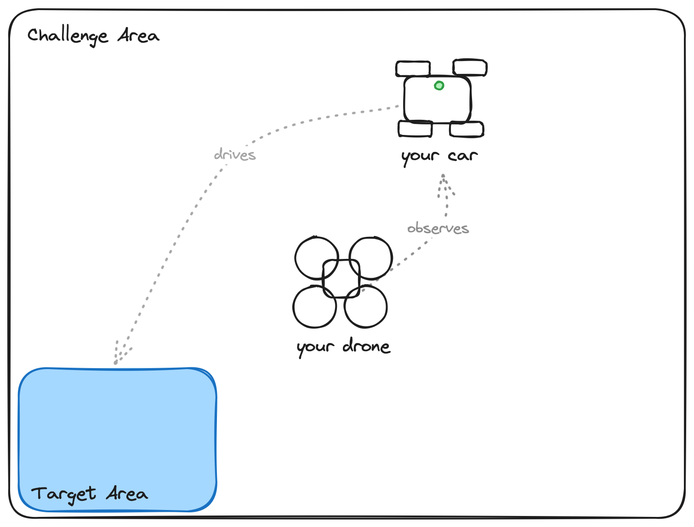
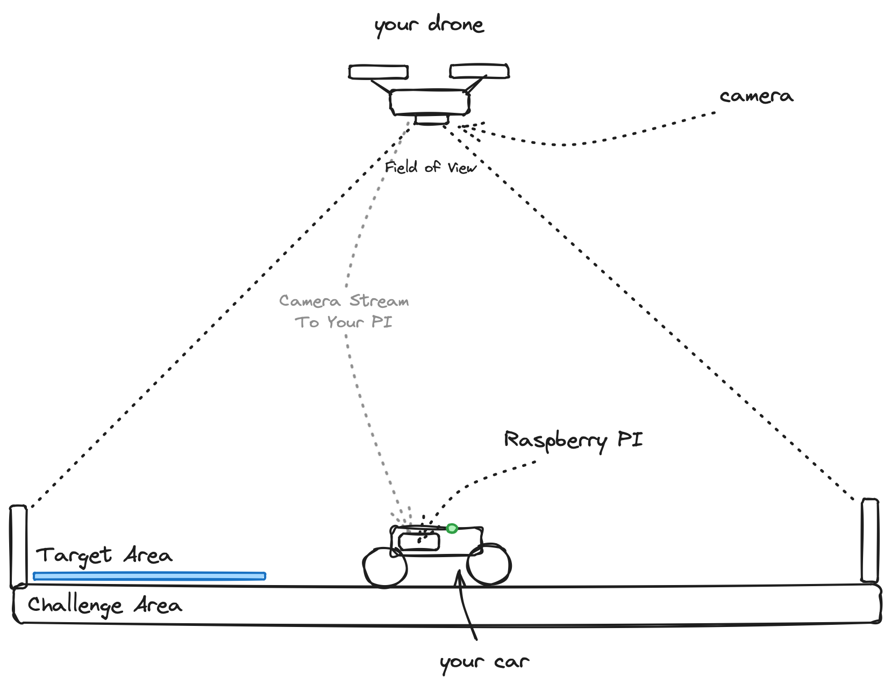

<!-- markdownlint-disable-next-line -->
<div align="center">


<br/>

# Rust Nation Hackathon 2024

**An embedded computer vision hackathon**

[](https://helsing.ai)
[](https://rustnationuk.com)

</div>

## Welcome

Welcome to Helsing's Rust Nation Hackathon! This is the very first edition of
our hackathon and we are glad to have you onboard. Enjoy!

## Rules & Setup

- You are going to work in **teams of 3-4** people.
- You may not move the drone outside of the enclosure.
- Connect to the `hs-rust-nation` wifi - please ask for the password from one of the team.

## Challenge

<div align="center">
    
    <br>
    <em>A top-down view of the challenge setup</em>
</div>

<br>

You and your team are responsible for writing an application that makes use of
computer vision, distributed systems, and networking to maneuver your team's car
(identified by the colored LED, in the example setup above: green) onto a color
coded target (in the example setup above: blue).

The challenge you need to solve here arises from the fact that *the car itself
has no sensors* and all information you have is coming from the drone's camera
and your computer vision algorithm.

<div align="center">
    
    <br>
    <em>A side view of the challenge setup</em>
</div>

<br>

The car is equipped with a Raspberry Pi that has access to the camera stream of
the drone and the car's hardware (e.g., you can drive the car from the Raspberry Pi).

Given the above setup and the libraries provided by Helsing, you should write
the high-level application logic to:

- Identify your car's position
- Identify the orientation of the car
- Move the car into the color-coded target area

> Please note: You are expected to develop this on your own laptop. Helsing
> provides you with libraries and deployment tooling, as well as the drone and the
> car, to make the above achievable in 1-2 hours.

## Quickstart

**Please use the
[template](https://github.com/helsing-ai/rust-nation-starter) for a seamless deployment experience**

- Form a team of 3-4 people and obtain your team's hardware from Helsing staff.
- Fork the repository and grant your team members access.
- Clone your team's repository and do a test deployment (to verify everything works).
- Start hacking!
- When you're ready to start driving the car, please ask and we'll connect the power supply.

## Deploying

```
$ rsync --exclude target -r ./ hack@<team>:/home/hack/
$ ssh hack@<team>
```

> Having DNS issues? Try using `nmap` and use the car's IP directly. (`nmap -sP 192.168.50.0/24`)

## Positioning the Drone

You need to position the drone yourself using `./scripts/aviate` (judging the FOV).

You can open `http://<car-name>:3000/camera` to see the drone's image and use
`./scripts/aviate <car-name> <command>` to position it manually.

## FAQ / Troubleshooting

### What is our team name?

Your team name is determined by the drone's label!

### What is the SSH / sudo password?

A Helsing staff member will provide you with your credentials.

### I can't SSH into the car..?

- Verify that the car's Raspberry Pi is on.
- You are on the `hs-rust-nation` network.
- Check that you can reach the car by `ping <team>`.
- If that doesn't work, try `nmap -sP 192.168.50.0/24` or ask Helsing staff.

### I don't have access to the aviator (`http://<car-name>:3000`)..?

- Check that the drone is on (touch the button on the side once).
- Check that you have a `wlp1s0u1u2` interface using `ifconfig`.
- Wait until you get an IPv4 address from the drone on that interface using `watch ifconfig`.
- If that doesn't happen, try `sudo systemctl restart drone-wifi`.
- Once you have the IP, do a `sudo systemctl restart aviator`.

### License

This project (including all source code and documentation) is available under the Apache-2 License.
